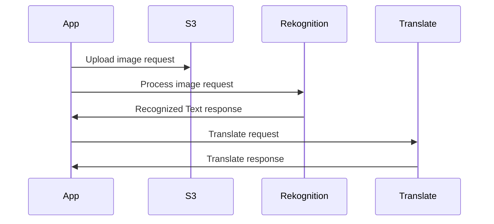

# A2Z Scope
App that captures an image that contains text and able to process text to translate to another language of users' choice. 
## Stack
To fit the team's common knowledge, we will use **javascript** to create a webapp. **React** will be used to render the view while no web framework (Express) is required as there is no process needed to be done in the server side except serving the content views. 
With many (lazy to explain) the downfall of javascript, we will utilize the power of **ES6** throughout the project. 
## Setup 
- We need to setup one shared account for the team, and probably acquire API keys from the AWS team in the Hackathon to access their api for free.
- Individual need to have Node installed locally, with your favorite IDE, but I would prefer Visual Code to be able to code live share.
- git?

## Sequence diagrams
This app contains no proxy server (backend). In fact, we do not need any except serving the app. All Apis make more sense to be called directly from the client because we do not need any layer in the server side to process the responses. There are no process/logic involves in manipulating the results of Rekognition and Translate before vending to the clients.

## Development Process
We can do live share to code together, but that would probably work if a group of less than 3 people are working on one package. Since the structure now requires only one package (no server side), it is better that we use the traditional way (git) since we might have multiple (at most 5) commit going on at the same time at the same place. Another reason is that javascript is very error prune, worst of all, run-time error. Without proper code verification, we will be out of sync very frequently and cause conflict in code change or product behavior. So Git Ready.

Every commit is required to send to me and another optional member if the change will potentially conflict (means working on the same feature). 
### Git
The process every one is required to commit a change is as follow:
1.  `git pull --rebase` to make sure your local repo is up to date.
2. `git add <your files>` to stage the changes, or use dot to stage all.
3. `git commit -m "message"` please please please write a good message. 
	> bad message: "rekognition"
	> good message: "integration with rekognition to get image's text"
	
4. Let's not do a serious time consuming code review, just make sure it works or ask me to take a look if not sure. 
5. `git push`

### Where things go
This project have 3 main folders of source. 
- component: Stateless react component
- containers: Stateful react component, usually the whole view
- services: Any processing, logic, api calls are here

## Setup
### Initial Setup
Git repo: [https://github.com/evanyui/A2Z_Scope](https://github.com/evanyui/A2Z_Scope)
1. `git clone` this repo
2. `npm install` to install all dependencies
3. `git status` make sure git is connected to remote and that after installing dependencies, gitignore is ignoring the generated modules folder. In other words, git status should be *clean*.
### Running the app
To run the app, simply do `npm start` in the root directory (where `package.json` is living). Note that this required all your dependencies are installed first.
This will start up a new tab in your default browser. 
### Development
Any new code changes when the app is running (`npm start`), you don't have to rerun/refresh the app. There is script written to make it auto refresh as you code anything new. 
### Debugging
Use your browser developer tools/console to see loggings. To debug component states, use react extension on chrome. 
[https://chrome.google.com/webstore/detail/react-developer-tools/fmkadmapgofadopljbjfkapdkoienihi?hl=en](https://chrome.google.com/webstore/detail/react-developer-tools/fmkadmapgofadopljbjfkapdkoienihi?hl=en)

## Reference
- Our own trello board to track tasks: [https://trello.com/b/GW8qoOD1/translator](https://trello.com/b/GW8qoOD1/translator)
- Rekognition docs: [https://docs.aws.amazon.com/rekognition/latest/dg/text-detecting-text-procedure.html](https://docs.aws.amazon.com/rekognition/latest/dg/text-detecting-text-procedure.html)
- Translate docs:
[https://docs.aws.amazon.com/translate/latest/dg/what-is.html](https://docs.aws.amazon.com/translate/latest/dg/what-is.html)
- Nodejs aws sdk:
[https://docs.aws.amazon.com/sdk-for-javascript/v2/developer-guide/getting-started-nodejs.html](https://docs.aws.amazon.com/sdk-for-javascript/v2/developer-guide/getting-started-nodejs.html)

